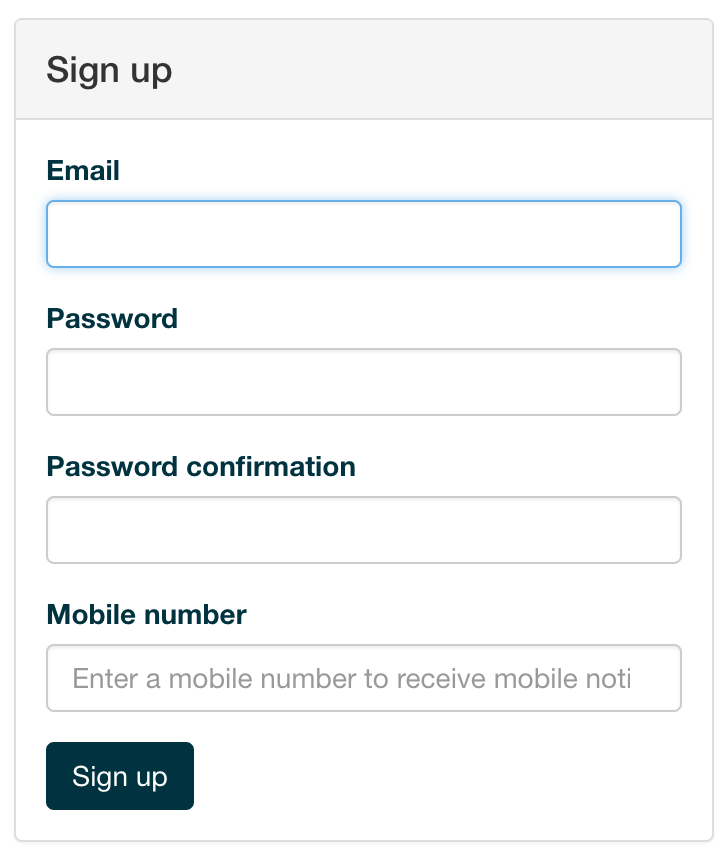
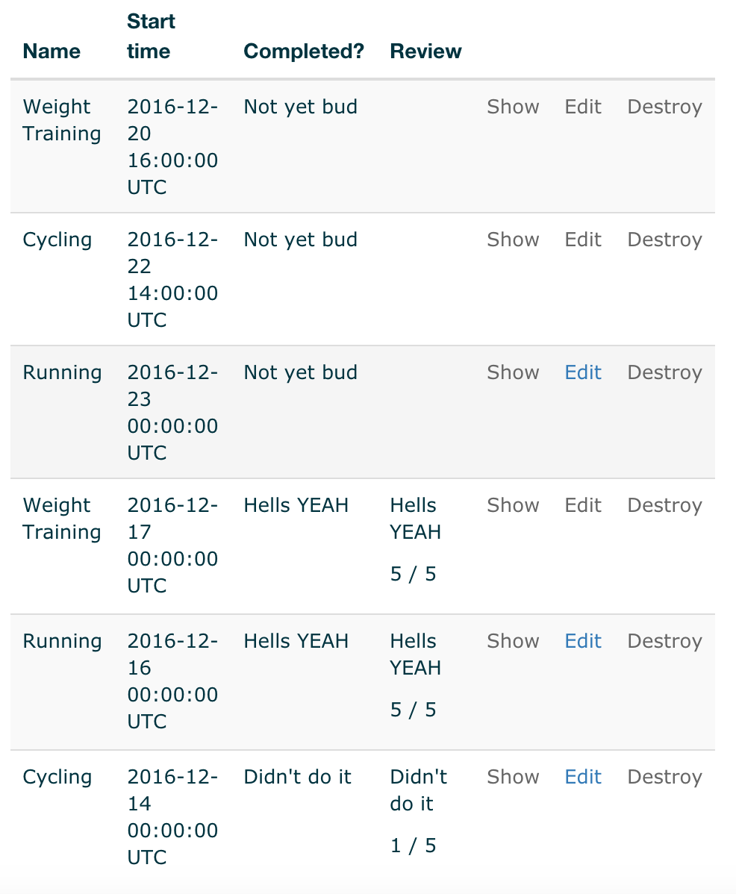

# BOOM! Training WebApp

## Concept
Inspired by many failed training sessions in the local gym, a member of our group had an idea for an app which would help to organise gym sessions for groups of people.
Better groups would mean better progress. Better progress would mean more weight. More weight would mean maximum feel-good factor!
BOOM! was born!

## Product Development
### Concept Flow Diagram
James Baker drew a minimalistic view of how the application should work including simple flow and routing. 

### Trello
Agile methodologies were used. Particularly Scrum and Kanban. Below is the workboard we used to keep track of what tasks were required and who was working on them. 

## Product Screenshots
After 1 week working on the project, here is the final product:  
#### Load Page

#### Registration
 
#### Login
 
#### Calendar
 
#### Activities
 
#### Groups
 
#### Profile

